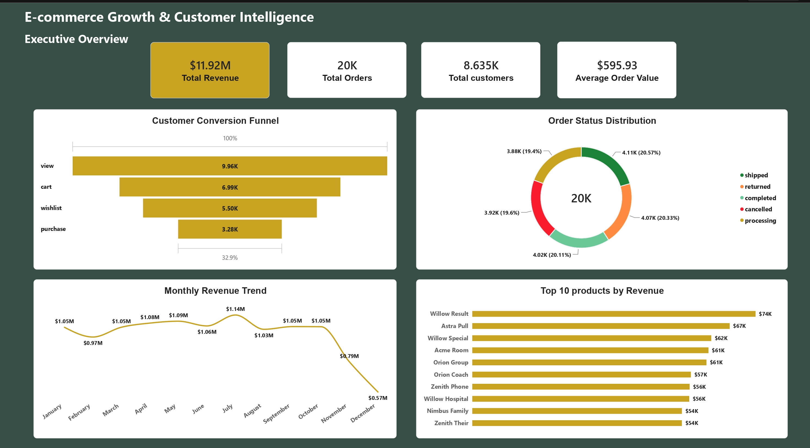
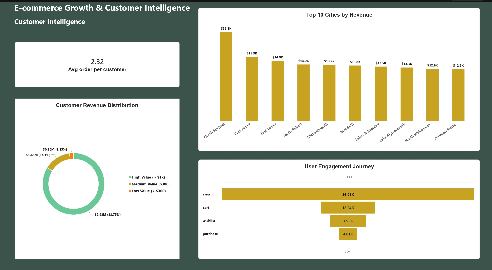

# 🛒# E-Commerce Growth & Customer Intelligence Analytics


An end-to-end Data Analytics project analyzing customer conversion funnels, revenue patterns, product ratings, and operational bottlenecks to support executive decision-making.


## 📌# 1. Introduction & Business Questions

E-commerce platforms face continuous challenges with user drop-offs and operational inefficiencies that impact profitability. This project analyzes transactional and user engagement data to answer key strategic questions:

- **Conversion Efficiency:** Where do customer drop-offs occur within the conversion funnel?
- **Revenue Drivers:** Which products drive the highest revenue?
- **Operational Performance:** What is the overall order failure rate, and which fulfillment stages are most impacted?
- **Customer Experience:** How are customer ratings and reviews distributed across the product catalog?

---

## 🛠️ # 2. Tech Stack & Tools

- **Database:** PostgreSQL
- **Data Processing & Pipeline:** Python, Pandas, SQLAlchemy
- **Visualization & Dashboard:** Power BI
- **IDE & Tools:** VS Code (Jupyter Notebooks, SQL Tools), Git & GitHub

---

## 📂 # 3. Repository Structure

```text
├── data/ # Raw and cleaned datasets
├── notebooks/ # Jupyter Notebooks (eda.ipynb)
├── sql/ # SQL analysis scripts (analysis.sql)
├── powerbi/ # Power BI report files (.pbix) & Screenshots
│ ├── page1_overview.png
│ ├── page2_customer.png
│ └── page3_operations.png
└── README.md # Master project documentation

```

## 🔍 4. Data Analysis with SQL
Key analytical steps executed in analysis.sql:

Conversion Funnel Modeling: Tracked movement from views to cart additions and final purchases.
Order Failure Analysis: Segmented order statuses to identify cancelled and returned orders.
Product Quality Analysis: Cross-analyzed failure rates against average product review ratings.

``` sql
WITH funnel AS (
SELECT
COUNT(DISTINCT CASE WHEN event_type = 'view' THEN user_id END) AS view_users,
COUNT(DISTINCT CASE WHEN event_type = 'cart' THEN user_id END) AS cart_users,
COUNT(DISTINCT CASE WHEN event_type = 'wishlist' THEN user_id END) AS wishlist_users,
COUNT(DISTINCT CASE WHEN event_type = 'purchase' THEN user_id END) AS purchase_users
FROM events
)
SELECT
view_users,
cart_users,
wishlist_users,
purchase_users,
ROUND(100.0 * cart_users / NULLIF(view_users, 0), 2) AS view_to_cart_pct,
ROUND(100.0 * purchase_users / NULLIF(cart_users, 0), 2) AS cart_to_purchase_pct,
ROUND(100.0 * purchase_users / NULLIF(view_users, 0), 2) AS overall_conversion_pct
FROM funnel;
```

## 📊 5. Power BI Dashboard Overview

### Page 1: Executive Overview



Key Metrics: Total Revenue ($11.92M), Total Orders (20,000), Avg Order Value ($595.93).

Core Visuals: Conversion Funnel, Order Status Distribution, Monthly Revenue Trend, Top 10 Products.


### Page 2: Customer Intelligence



Key Metrics: Avg Orders per Customer (2.32).

Core Visuals: Top 10 Cities by Revenue, Customer Revenue Segmentation, User Engagement Journey.


### Page 3: Product & Operations


 Key Metrics: Overall Order Failure Rate (~40%).

Core Visuals: Product Failure Analysis, Failure Rate vs. Customer Rating, Product Ratings & Review Volume.


## 📈 6. Key Findings & Business Story

Executive KPIs...

- Total Orders: 20,000
- Total Revenue: $11.92M
- Average Order Value: $595.93

## Conversion Funnel Analysis
- View-to-Cart Rate: 70.21% of visitors add products to cart.
- Cart Abandonment: 53.09% of users who add products to cart do not complete a purchase.

## Order Failure Rate
- ~40% of orders were either cancelled (19.60%) or returned (20.33%).

## Root Cause Analysis
- Products such as Willow Woman, Pulse Race, and Astra Hundred showed failure rates between 65% and 70%.
- Astra Hundred had the lowest average customer rating (3.55/5) among the analyzed high-failure products, indicating a potential relationship between product issues and customer dissatisfaction.


## 🎯 7. Actionable Business Recommendations

Product Audit: Review supplier quality and product-level issues for high-failure products such as Astra Hundred and Willow Woman.
Cart Recovery: Use automated email triggers and targeted incentives to recover abandoned carts.
UX & Sizing Guidelines: Improve product descriptions and sizing information to set more accurate customer expectations and potentially reduce returns.


##  8. Conclusion & Closing Thoughts
This end-to-end analysis bridges raw transactional data with operational strategy. By addressing funnel drop-offs and investigating high-failure products, the business can potentially reduce order failures and improve customer retention.