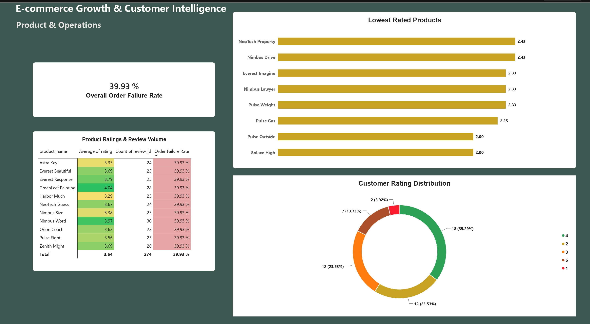

# 🛒# E-Commerce Growth & Customer Intelligence Analytics

An end-to-end e-commerce analytics case study focused on understanding revenue performance, customer behavior, conversion funnel performance, and order failure patterns.

The project combines SQL, PostgreSQL, Power BI, DAX, Power Query, and Python to transform raw e-commerce data into actionable business insights.


## 📌 Executive Summary 

This analysis examines e-commerce transactions and customer behavior to identify opportunities for improving revenue efficiency, conversion, and customer experience.


# Key Metrics
-Total Revenue: $11.92M
-Total Orders: 20,000
-Total Customers: 8,635
-Average Order Value (AOV): $595.93
-Average Orders per Customer: 2.32
-Purchase Conversion Rate: 32.9%
-Revenue from High-Value Customers: 83.75%


## #  Main Business Insights
 
-A significant proportion of customers who added products to their cart did not complete a purchase.
-Cancelled and returned orders represent a substantial share of total orders.
-Several products show unusually high order failure rates.
-Product ratings and order failure were analyzed together to identify products requiring further investigation.
-Revenue is highly concentrated among high-value customers, highlighting the importance of customer retention and value management.

The analysis suggests that growth opportunities are not limited to acquiring more customers. Improving cart conversion, product performance, and order fulfillment may also have a meaningful impact on revenue efficiency and customer experience.


## 📊 Power BI Dashboard Overview

### Page 1: Executive Overview


Key Metrics: Total Revenue ($11.92M), Total Orders (20,000), Avg Order Value ($595.93).

Core Visuals: Conversion Funnel, Order Status Distribution, Monthly Revenue Trend, Top 10 Products.


### Page 2: Customer Intelligence


Key Metrics: Avg Orders per Customer (2.32).

Core Visuals: Top 10 Cities by Revenue, Customer Revenue Segmentation, User Engagement Journey.


### Page 3: Product & Operations



 Key Metrics: Cancelled & Returned Orders (~40%)

Core Visuals: Product Failure Analysis, Failure Rate vs. Customer Rating, Product Ratings & Review Volume.


## Business Problem

E-commerce businesses need to understand not only how much revenue they generate, but also where revenue opportunities and operational problems exist.

This analysis was designed to investigate customer behavior across the purchasing funnel, identify major revenue drivers, evaluate order performance, and highlight products that may require operational or customer-experience attention.


## Business Questions

The analysis was designed to answer the following questions:

Where are customers dropping off in the e-commerce conversion funnel?
Which products and customer segments contribute most to revenue?
How significant are cancelled and returned orders?
Which products show unusually high order failure rates?
Is there an observable relationship between product ratings and order failure?
Which findings represent the most actionable opportunities for improving growth and customer experience?


## Key Findings

# Executive Performance
-Total revenue reached $11.92M across 20,000 orders.
-Average Order Value (AOV) was $595.93.
-Customers placed an average of 2.32 orders each.

## Conversion Funnel

-70.21% of users who viewed products added items to their cart.
-53.09% of users who added items to their cart did not complete a purchase.
-This indicates a meaningful opportunity to improve the transition from purchase intent to completed transactions.

## Order Performance

-Approximately 40% of orders were either cancelled or returned.
-Cancelled orders represented 19.60%.
-Returned orders represented 20.33%.


## Customer Intelligence

-High-value customers contributed approximately 83.75% of total revenue.
-This concentration highlights the importance of retaining and understanding high-value customer segments.

## Product & Customer Experience

-Several products showed failure rates between 65% and 70%.
-Among the highlighted high-failure products, Astra Hundred had the lowest average rating at 3.55/5.


## 💡 Business Recommendations

1. # Investigate High-Failure Products
Prioritize products with unusually high cancellation and return rates.

Areas to investigate include:

-Supplier quality
-Product descriptions
-Customer complaints
-Return reasons
-Fulfillment performance

2. # Improve Cart Recovery
The high cart abandonment rate indicates an opportunity to recover customers who have already demonstrated purchase intent.

Potential actions include:

-Abandoned-cart reminders
-Targeted incentives
-Personalized follow-up campaigns
-Checkout experience improvements

3. # Improve Product Information
For products with high return rates, review:

-Product descriptions
-Product images
-Sizing or specifications
-Customer expectations
-Review content

Improving product information may help reduce expectation gaps that contribute to returns.

4. # Monitor Product Performance
Create a recurring product-level monitoring process combining:

-Revenue
-Orders
-Failure rate
-Customer rating
-Review volume

This would help identify products requiring operational or customer-experience intervention.

5. # Focus on High-Value Customers
Because a large proportion of revenue comes from high-value customers, the business should monitor:

-Repeat purchasing behavior
-Customer lifetime value
-Purchase frequency
-Retention
-Revenue concentration

This can support more targeted retention and customer-growth strategies.


## 🛠️ Tools & Technologies

- PostgreSQL — Data querying and analysis
- SQL — Business analysis, aggregations, CTEs, funnel analysis
- Power BI — Interactive dashboard development
- DAX — Business metrics and calculated measures
- Power Query — Data transformation
- Python / Jupyter Notebook — Exploratory data analysis
- Git & GitHub — Version control and project management


## 📂 Data
The project uses e-commerce datasets containing information related to:

-Orders
-Customers
-Products
-Product ratings and reviews
-Customer events
-Purchase funnel activity

The data was loaded into PostgreSQL for structured analysis and connected to Power BI for visualization.


```
```
## 🔍  Data Analysis with SQL
Key analytical steps executed in `sql/analysis.sql`:

- **Conversion Funnel Modeling: Tracked movement from product views to cart additions, wishlists, and final purchases.

Order Failure Analysis: Segmented order statuses to identify cancelled and returned orders.
Product Quality Analysis: Cross-analyzed failure rates against average product review ratings.

``` sql
WITH funnel AS (
SELECT
COUNT(DISTINCT CASE WHEN event_type = 'view' THEN user_id END) AS view_users,
COUNT(DISTINCT CASE WHEN event_type = 'cart' THEN user_id END) AS cart_users,
COUNT(DISTINCT CASE WHEN event_type = 'wishlist' THEN user_id END) AS wishlist_users,
COUNT(DISTINCT CASE WHEN event_type = 'purchase' THEN user_id END) AS purchase_users
FROM events
)
SELECT
view_users,
cart_users,
wishlist_users,
purchase_users,
ROUND(100.0 * cart_users / NULLIF(view_users, 0), 2) AS view_to_cart_pct,
ROUND(100.0 * purchase_users / NULLIF(cart_users, 0), 2) AS cart_to_purchase_pct,
ROUND(100.0 * purchase_users / NULLIF(view_users, 0), 2) AS overall_conversion_pct
FROM funnel;

```

## Repository Structure
Ecommerce-Growth-Customer-Intelligence/
│
├── README.md
├── business_questions.md
├── findings.md
├── recommendations.md
├── limitations.md
│
├── data/
│
├── notebooks/
│   └── eda.ipynb
│
├── sql/
│   └── analysis.sql
│
└── powerbi/
    ├── page1_overview.png
    └── page2_customer.png
    └── page3_Operations.png

## 📈 Analytical Limitations
-The analysis identifies patterns and associations in the available data but does not establish causal relationships.
-Product ratings and order failure rates were analyzed together, but the relationship does not prove that lower ratings directly cause order failures.
-Additional information such as return reasons, customer demographics, acquisition channels, and fulfillment-level details could provide deeper insight into the observed patterns.
-The recommendations are based on the available dataset and should be validated against operational and customer-level data before implementation.


## 🎯 Conclusion
The analysis highlights several opportunities to improve e-commerce performance beyond simply increasing customer acquisition.

The most significant opportunities identified are related to:

-Improving cart-to-purchase conversion
-Investigating products with high failure rates
-Reducing cancellations and returns
-Improving product information and customer expectations
-Understanding and retaining high-value customers

Together, these insights provide a data-driven starting point for improving revenue efficiency, customer experience, and e-commerce growth.
